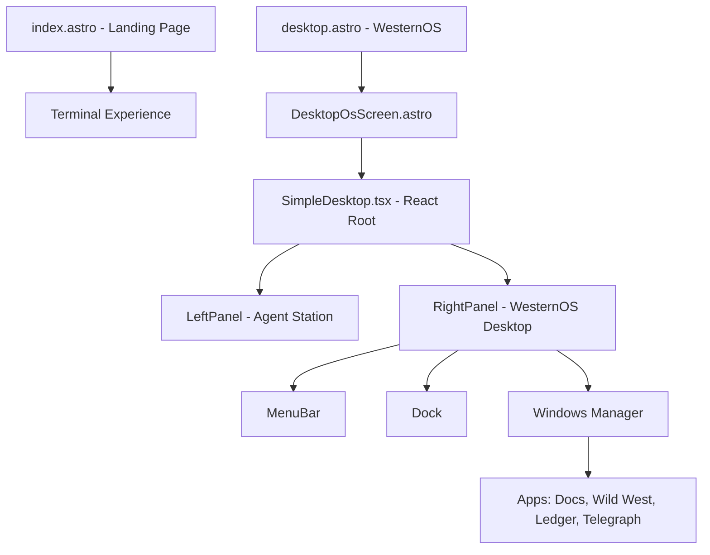

# WesternOS Architecture

## Overview
WesternOS is a hybrid Astro + React application designed for agentic workflows. It uses a dual-panel layout to separate the "Agent Intelligence" from the "Operating System Environment".

---

## Component Hierarchy

## State Management
- **Window State:** Managed in `SimpleDesktop.tsx` using React `useState`.
- **API Config:** Peristed in `localStorage` (`agent_apiKey`, `agent_provider`).
- **File System:** Managed via `BrowserFS` with IndexedDB persistence.

## File System Structure (BrowserFS)
- `/home/user/` - User documents and settings
- `/system/apps/` - Application configurations
- `/tmp/` - Volatile storage
- `/public/fs/` - HTTP backup for static assets

## Agent Integration
- **Hook ID:** `agent-workbench-hook` (located in the Left Panel).
- **Communication:** Via `window.postMessage` or standard DOM events.
- **Agent Payload:** Expected to be injected via script or iframe by AgenticSeek.

## Security Model
- **Iframe Isolation:** All external content runs in sandboxed iframes.
- **Permissions:** `allow-scripts allow-same-origin allow-forms`.
- **Storage Isolation:** OS files stored in a named IndexedDB store (`westernos-fs`).

## UI/UX Standards
- **Styling:** Inline React styles for the OS core to ensure framework independence.
- **Aesthetic:** High-contrast "Modern Tech" (Left) vs "Wild West Frontier" (Right).
- **Icons:** SVG and Emoji based for light weight.

---

## Technical Debt / Known Constraints
1. **No Backend Sync:** Current file system is browser-local (IndexedDB).
2. **Inline Styling:** While robust, it makes global theme changes more manual.
3. **Single Process:** React manages all windows in a single render tree.
